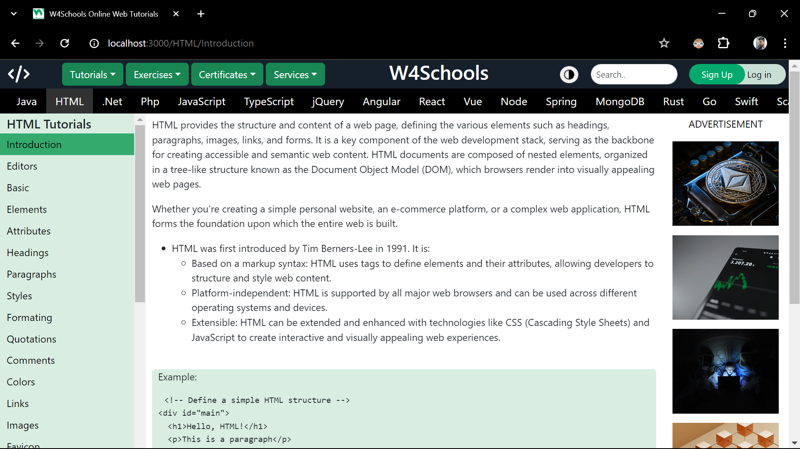

# W3Schools Replica

## Project Description: 
This project replicates the user interface (UI) of W3Schools using React.js. It aims to provide a modern and interactive version of educational website, leveraging the power of React components and React Router for seamless navigation between different sections of the site.


[W4Schools](https://amancantgit.github.io/W3Schools-Clone/)


### `Features`:
1. W3Schools UI Replication: The project closely resembles the user interface (UI) of W3Schools, maintaining the familiar layout and design elements.
2. Modern and Interactive Experience: Through the use of React.js, the project enhances the user experience by offering modern and interactive features.
3. Seamless Navigation: React Router is integrated to facilitate seamless navigation between different sections and pages of the website.
4. Search Option: Users can utilize the built-in search functionality to easily find and access specific courses within the website.
5. Responsive Design: Ensures optimal display across devices.


### `Technologies used`: 
React.js, HTML/CSS & JavaScript

### Installation Steps
Follow these steps to set up and run the project locally:

1. **Clone the repository:**
   Clone the repository to your local machine by running the following command in your terminal:
   ```sh
   git clone https://github.com/your-username/your-project.git
2. Install any neccessary dependencies.
3. Run the project locally using npm start.


## Available Scripts
In the project directory, you can run:

### `npm start`

Runs the app in the development mode.\
Open [http://localhost:3000](http://localhost:3000) to view it in your browser.

The page will reload when you make changes.\
You may also see any lint errors in the console.

### `npm test`

Launches the test runner in the interactive watch mode.\
See the section about [running tests](https://facebook.github.io/create-react-app/docs/running-tests) for more information.

### `npm run build`

Builds the app for production to the `build` folder.\
It correctly bundles React in production mode and optimizes the build for the best performance.

The build is minified and the filenames include the hashes.\
Your app is ready to be deployed!

See the section about [deployment](https://facebook.github.io/create-react-app/docs/deployment) for more information.

